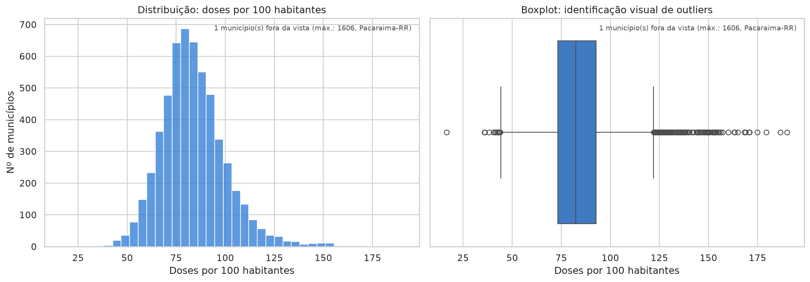
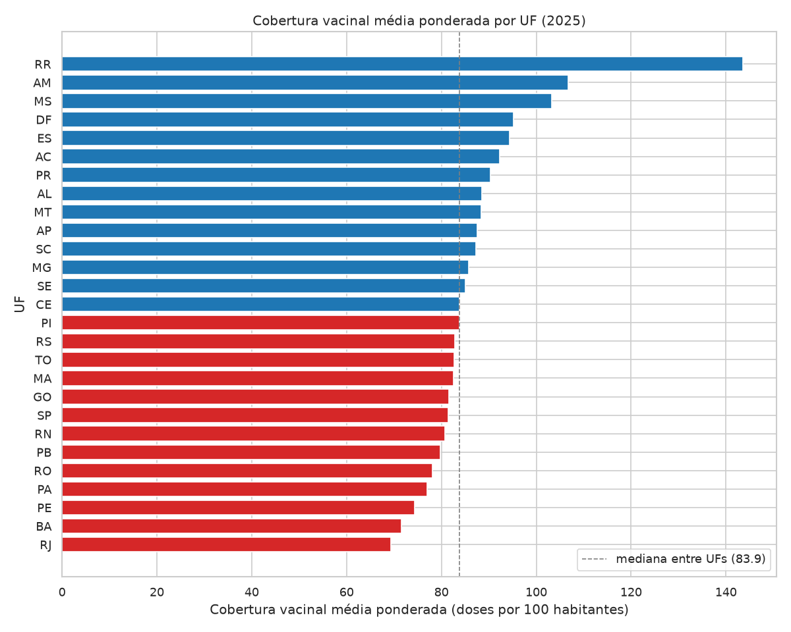
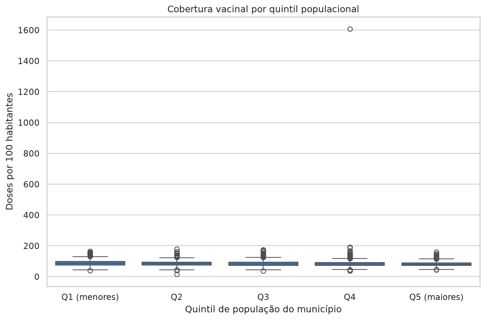
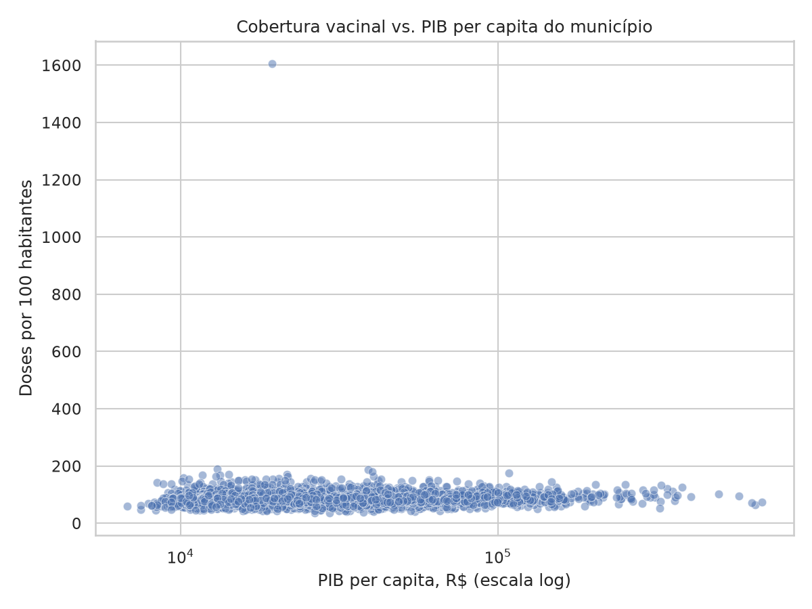
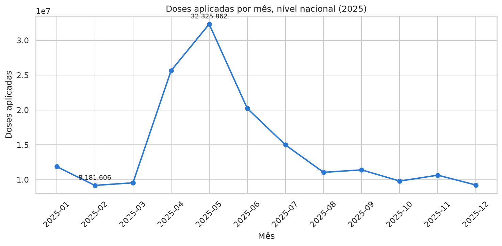

# Análise Exploratória de Dados (Etapa 2)

Este documento reúne, com texto explicativo, os gráficos gerados pelo
notebook [`notebooks/02_analise_exploratoria.ipynb`](../notebooks/02_analise_exploratoria.ipynb)
e salvos em `reports/`. O objetivo é que os gráficos não fiquem soltos na
pasta: cada um aqui vem acompanhado do porquê de ter sido gerado, do que
ele mostra e do que isso significa para o problema descrito em
[`docs/entendimento_problema.md`](entendimento_problema.md).

A métrica analisada em todo o documento é a **cobertura vacinal**, definida
como doses aplicadas por 100 habitantes, calculada por município a partir
do cruzamento PNI (doses aplicadas) × IBGE (população). A base de EDA tem
**5.571 municípios** (dataset `refined`, ano 2025).

## 1. Estatísticas descritivas consolidadas

Antes de olhar para gráficos individuais, é preciso saber como a variável
central do projeto se comporta em números. A tabela abaixo (gerada na
seção 1 do notebook) resume `cobertura_doses_por_100_habitantes`,
`populacao`, `pib_per_capita_reais` e `doses_aplicadas` num único lugar —
contagem, média, mediana, desvio padrão, quartis e assimetria.

Para a cobertura vacinal especificamente, os números observados são:

| Estatística | Valor |
|---|---|
| N (municípios) | 5.571 |
| Média | 84,26 |
| Mediana | 82,31 |
| Desvio padrão | 26,44 |
| Mínimo | 16,59 |
| Q1 (25%) | 73,24 |
| Q3 (75%) | 92,76 |
| Máximo | 1.606,41 |

**Leitura:** média (84,26) e mediana (82,31) são próximas entre si, o que
indicaria à primeira vista uma distribuição razoavelmente simétrica — mas
o desvio padrão (26,44) já é grande frente a esses valores centrais, e a
distância entre a mediana e o máximo (1.606,41) é enorme. Isso é o
primeiro sinal de que a distribuição tem uma cauda direita muito pesada,
formada por um pequeno número de municípios com cobertura extrema — o que
a seção 2 confirma formalmente.

## 2. Distribuição da cobertura vacinal

Este histograma + boxplot responde à pergunta "como a cobertura vacinal se
distribui entre os municípios brasileiros?". Ele é o ponto de partida da
EDA porque toda decisão de modelagem na Etapa 3 (por exemplo, a escolha de
tratar o problema como classificação binária em vez de regressão direta
sobre a cobertura) depende de entender essa distribuição.

**O que o gráfico mostra:** a maior parte dos municípios está concentrada
entre ~75 e ~90 doses por 100 habitantes (o pico do histograma), mas o
boxplot mostra um número grande de outliers em ambas as caudas — a cauda
direita é a mais extrema, a ponto de o gráfico anotar explicitamente "1
município fora da vista (máx.: 1606, Pacaraima-RR)" para manter a escala
legível para os demais 5.570 municípios.

**Assimetria e curtose (seção 2.1 do notebook):** a assimetria calculada é
de **34,48** e a curtose de Fisher é de **1.970,87**. Para efeito de
comparação, uma distribuição normal tem assimetria 0 e curtose de Fisher
0; valores nessa magnitude classificam a distribuição da cobertura como
**extremamente assimétrica à direita e extremamente leptocúrtica** — ou
seja, um pico estreito e concentrado, com caudas muito mais pesadas do que
uma normal preveria. Isso confirma numericamente o que o histograma sugere
visualmente e reforça a decisão (documentada em
[`docs/decisoes_modelagem.md`](decisoes_modelagem.md)) de tratar municípios
extremos com cuidado na modelagem, em vez de assumir uma distribuição bem
comportada.

## 3. Municípios extremos

A seção 3 do notebook lista os 10 municípios de menor e de maior cobertura
vacinal. Os extremos observados são:

- **Menor cobertura:** Boa Esperança do Norte-MT, com 16,59 doses por 100
  habitantes.
- **Maior cobertura:** Pacaraima-RR, com 1.606,41 doses por 100
  habitantes — mais de 19x a mediana nacional (82,31), aplicando 371.274
  doses para uma população de apenas 23.112 habitantes.

**Leitura:** antes de tudo, uma ressalva sobre a métrica: passar de 100
doses por 100 habitantes **não** é anomalia por si só. A métrica conta
doses, não pessoas, e uma mesma pessoa recebe várias doses ao longo do ano
(vacinas diferentes, esquemas multidose, reforços) — por isso 100 não é
teto de nada. A própria seção 4 mostra três UFs inteiras acima de 100 na
média ponderada (RR 143,5, AM 106,7 e MS 103,2), o que não seria possível
se o valor indicasse "percentual de pessoas vacinadas".

O que chama atenção em Pacaraima não é ultrapassar 100, é a **ordem de
grandeza**: 1.606 doses por 100 habitantes significa aproximadamente 16
doses por morador no ano, contra uma mediana nacional de menos de uma. Um
número desses não se explica por esquema multidose. Pacaraima é município
de fronteira com a Venezuela, e a hipótese mais consistente é atendimento
a população não-residente (fronteiriça/migrante) inflando o numerador sem
afetar o denominador — não um erro de dado. Essa hipótese de "efeito
fronteira" é retomada e reforçada na seção 4.

## 4. Cobertura vacinal média por UF

Aqui a cobertura é agregada por Unidade da Federação (ponderada pela
população de cada município, para que municípios grandes não sejam
sub-representados) para responder à pergunta "a baixa cobertura se
concentra em regiões específicas, ou está espalhada pelo país?" — uma das
perguntas centrais definidas em `docs/entendimento_problema.md`.

**O que o gráfico mostra:** um ranking das 27 UFs, da maior cobertura
média para a menor, com uma linha tracejada marcando a mediana entre UFs
(83,9). As UFs em azul (da mediana para cima) lideradas por **RR (143,5)** e
**AM**, seguidas por MS, DF, ES, AC, PR, AL, MT, AP, SC, MG, SE e CE — este
último (83,87) praticamente sobre a própria linha da mediana; as UFs
em vermelho (abaixo da mediana) vão de PI, RS, TO, MA, GO, SP, RN, PB, RO,
PA, PE, BA até **RJ (69,3)**, a menor média do país.

**Leitura:** Roraima e Amazonas — os dois estados com fronteiras
internacionais mais extensas e cidades-polo de atendimento fronteiriço —
lideram com folga a cobertura média, o que é consistente com a hipótese
levantada na seção 3 a partir do caso Pacaraima: parte da cobertura
"alta" nesses estados reflete atendimento a população não-residente, não
necessariamente uma cobertura real da população local acima de 100%. Isso
é um achado relevante para a Etapa 3: um modelo preditivo que não souber
diferenciar "cobertura alta por acesso fronteiriço" de "cobertura alta por
boa gestão de saúde local" vai confundir dois fenômenos diferentes. RJ na
última posição, por outro lado, é um sinal que merece investigação
qualitativa fora do escopo deste projeto (não é explicado pelos dados
disponíveis aqui).

## 5. Cobertura vacinal vs. população

A hipótese testada aqui é que municípios pequenos tendem a ter cobertura
mais volátil (mais fácil de "disparar" a métrica com poucas doses fora do
padrão, dado o denominador populacional pequeno). Os municípios válidos
foram divididos em 5 quintis de população (Q1 = menores, Q5 = maiores) e a
cobertura foi comparada entre eles.

**O que o gráfico mostra:** os 5 boxplots de cobertura por quintil
populacional são visualmente muito parecidos entre si, todos concentrados
na faixa aproximada de 75 a 100 doses por 100 habitantes — não há um
padrão visual óbvio de "quintis menores têm caixas mais espalhadas". O
outlier de Pacaraima-RR (1.606,41) aparece especificamente acima da caixa
do quintil Q4 (não do Q1, como a hipótese de "município pequeno é mais
volátil" sozinha sugeriria).

**Leitura numérica (seção 5.1 do notebook, cálculo de desvio padrão por
quintil):** os valores reais, após a re-execução do notebook, são:

| Quintil | Média | Mediana | Desvio padrão |
|---|---|---|---|
| Q1 (menores) | 87,28 | 85,79 | 17,84 |
| Q2 | 85,33 | 83,95 | 16,94 |
| Q3 | 83,92 | 81,50 | 18,05 |
| Q4 | 83,70 | 80,81 | **48,47** |
| Q5 (maiores) | 81,05 | 80,18 | 14,08 |

Comparando os dois extremos — como faz o notebook, que gera essa
conclusão dinamicamente a partir do resultado real —, o desvio padrão de
Q1 (17,84) é de fato maior do que o de Q5 (14,08): **é um indício a favor**
da hipótese de que municípios menores têm cobertura mais volátil, mas não
uma confirmação. A diferença é modesta e, sobretudo, **não é monotônica** —
o Q3 (18,05) tem desvio maior que o próprio Q1, então não existe um
gradiente limpo de volatilidade decrescente conforme o porte aumenta. O que
os dados sustentam é a comparação entre os extremos; tratar isso como lei
geral seria ir além da evidência. Isso também explica por que os boxplots
parecem tão parecidos visualmente entre si.

O valor de Q4 (48,47) chama atenção por ser quase o triplo dos demais
quintis, mas não é um segundo polo de volatilidade por porte populacional:
é o próprio outlier de Pacaraima-RR (1.606,41 doses por 100 habitantes,
seção 3) caindo dentro da faixa de população do Q4. Um único valor tão
extremo já é suficiente para inflar o desvio padrão de um grupo de ~1.100
municípios — o número não indica que municípios de porte "médio-alto"
sejam sistematicamente mais voláteis que os vizinhos.

Juntando os dois pontos: o efeito de porte populacional existe (Q1 mais
volátil que Q5), mas é discreto frente ao efeito de fronteira (seção 4),
que segue sendo o padrão geográfico mais marcante identificado nesta EDA.

## 6. Cobertura vacinal vs. PIB per capita

Esta é a pergunta mais frequentemente feita sobre o problema — "cobertura
vacinal está associada a renda/nível socioeconômico do município?" — e
foi tratada com atenção especial por ter sido apontada explicitamente
pelo professor como merecendo uma resposta mais explícita.

**O que o gráfico mostra:** um scatter plot com o PIB per capita em escala
logarítmica no eixo X (necessário porque os valores variam de poucos
milhares a mais de R$ 600 mil — ver os outliers abaixo) contra a cobertura
vacinal no eixo Y. A nuvem de pontos é visualmente dispersa em toda a
faixa de PIB, sem um padrão de inclinação, afunilamento ou agrupamento
claro — o que já antecipa visualmente a conclusão quantitativa abaixo: não
há uma relação forte entre as duas variáveis. Abaixo estão as respostas
diretas às perguntas do professor, geradas no notebook (seção 6.1) a
partir dos números reais calculados nas células anteriores:

**A correlação é forte ou fraca?** Fraca nos dois critérios usados:
Pearson r = **0,0539** (p = 5,75e-05) e Spearman rho = **0,1035**
(p = 9,55e-15). Ambos os valores estão muito distantes de 1 (ou de -1);
mesmo sendo estatisticamente significativos — o que se explica pelo
tamanho grande da amostra (N = 5.570), não pela força da relação em si.

**Ela é linear?** O r² de Pearson é 0,0539² ≈ **0,29%** da variância da
cobertura explicada linearmente pelo PIB per capita — praticamente nula.
O fato de o Spearman (que capta relação monotônica, não necessariamente
linear) ser quase o dobro do Pearson é um indício de que a pouca
associação que existe não é bem descrita por uma reta.

**Há municípios discrepantes?** Sim, dos dois lados. No eixo do PIB per
capita, os 5 municípios de maior PIB per capita do país (seção 6.2 do
notebook) são: Saquarema-RJ (R$ 678.813,83), São Francisco do Conde-BA
(R$ 644.751,57), Maricá-RJ (R$ 631.110,43), Paulínia-SP
(R$ 574.826,44) e Presidente Kennedy-ES (R$ 496.109,01). Esses não são
municípios de alta renda média — são casos de concentração de royalties
de petróleo ou grandes plantas industriais/refinarias, que inflam o PIB
per capita sem refletir o padrão de vida médio da população. No eixo da
cobertura, os extremos já discutidos na seção 3 (Pacaraima-RR) também
aparecem visivelmente no gráfico, sem relação com PIB.

**Existem grupos regionais diferentes?** Sim — a seção 4 já mostrou que
UFs de fronteira (RR, AM) têm cobertura média muito acima do resto do
país por um efeito geográfico de atendimento a não-residentes, não
relacionado a PIB per capita.

**O PIB explica realmente parte relevante da variabilidade?** Não: cerca
de 0,29% de variância explicada é irrelevante na prática, mesmo sendo
estatisticamente significativo dado o N grande da amostra.

**Quais variáveis apresentam maior associação com a cobertura?** Entre as
avaliadas nesta etapa, o notebook (seção 6.1) também calcula a correlação
de Spearman entre população e cobertura para comparação direta com o PIB:
rho = -0,1337 (p = 1,18e-23) — fraca, mas negativa, e um pouco mais forte
em módulo do que a do PIB per capita (rho = 0,1035). O sinal negativo é
consistente com o padrão já visto na seção 5: municípios menores tendem a
ter cobertura levemente mais alta e mais volátil. Isoladamente, nenhuma
das duas variáveis numéricas (população, PIB per capita) mostra associação
forte com a cobertura; o padrão geográfico de fronteira (seções 3 e 4) é
visualmente mais marcante
do que qualquer uma delas, e é por isso que uma variável de fronteira
(indicador de município fronteiriço) foi incorporada como feature na
Etapa 3 — ver [`docs/decisoes_modelagem.md`](decisoes_modelagem.md).

## 7. Sazonalidade de doses aplicadas ao longo do ano

Este gráfico agrega o total nacional de doses aplicadas por mês em 2025,
para responder a uma pergunta diferente das anteriores: não "onde" a
cobertura é maior ou menor, mas "quando" a aplicação de doses se
concentra ao longo do ano — relevante para entender se picos/vales pontuais
no calendário nacional podem distorcer análises feitas com um corte anual
único.

**O que o gráfico mostra:** um vale em fevereiro de 2025, com
**9.181.606 doses** aplicadas no mês, seguido por uma subida acentuada até
um pico em maio de 2025, com **32.325.862 doses** — uma variação de
**252,1%** entre o vale e o pico — e depois um declínio gradual até
dezembro.

**Leitura:** o pico de maio é compatível com o período típico da Campanha
Nacional de Vacinação contra a Influenza (que historicamente ocorre entre
março e maio no Brasil) — uma explicação de calendário plausível para o
padrão, muito mais provável que uma anomalia de dado. Vale marcar que é
uma **hipótese não testada**: o dado do PNI usado aqui agrega todos os
imunobiológicos, e confirmar a atribuição exigiria segmentar por tipo de
vacina, o que está fora do recorte desta etapa. Isso reforça uma
limitação já documentada no projeto: como o dataset processado cobre
apenas o ano de 2025, a cobertura calculada é sensível a este calendário
de campanhas — um ano com calendário de campanhas diferente poderia
produzir números de cobertura anual diferentes mesmo com comportamento
populacional idêntico.

## 8. Síntese e conexão com a Etapa 3

Os achados desta EDA moldaram diretamente as decisões de modelagem
documentadas em [`docs/decisoes_modelagem.md`](decisoes_modelagem.md):

- A distribuição extremamente assimétrica da cobertura (seção 2) e a
  presença de outliers extremos concentrados em poucos municípios (seção
  3) motivaram a escolha de **classificação binária** (cobertura
  adequada/baixa a partir de um limiar) como enquadramento principal, com
  regressão tratada como enquadramento complementar.
- O efeito de fronteira identificado nas seções 3 e 4 (RR/AM com cobertura
  muito acima da média, puxada por municípios como Pacaraima) motivou a
  criação de uma feature explícita de município fronteiriço, em vez de
  deixar esse padrão geográfico apenas implícito nos dados.
- A correlação fraca entre PIB per capita e cobertura (seção 6) foi
  registrada como uma expectativa a priori de que PIB per capita
  isoladamente não seria uma feature forte — o que foi checado contra o
  resultado real do modelo (importância de features) na Etapa 3.
- A lição mais transferível desta etapa, porém, veio da comparação entre
  correlação e importância: features com correlação linear quase nula com
  a cobertura acabaram carregando sinal real no modelo. É o caso do CNES
  (correlação 0,090, 2ª maior importância) e do saneamento/água
  (correlação **−0,019**, 5ª maior importância) — variáveis adicionadas
  ao conjunto depois desta EDA. Correlação simples mede associação
  linear par a par; um modelo em árvore capta interações que ela não
  enxerga. Por isso nenhuma feature candidata foi descartada *só* por ter
  correlação fraca nesta etapa.
- A sazonalidade de doses (seção 7) reforça uma limitação já conhecida do
  projeto: um único ano de dado processado impede análise de série
  temporal robusta, o que já está refletido na escolha de classificação
  transversal em vez de previsão temporal (ver
  `docs/entendimento_problema.md`, pergunta 5).
