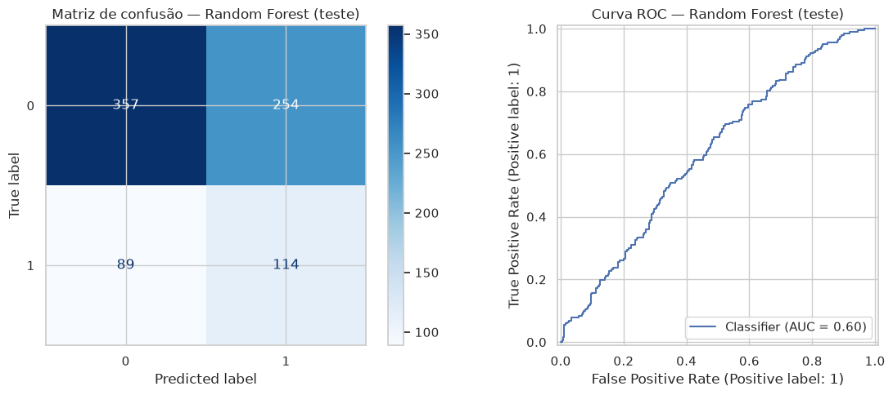
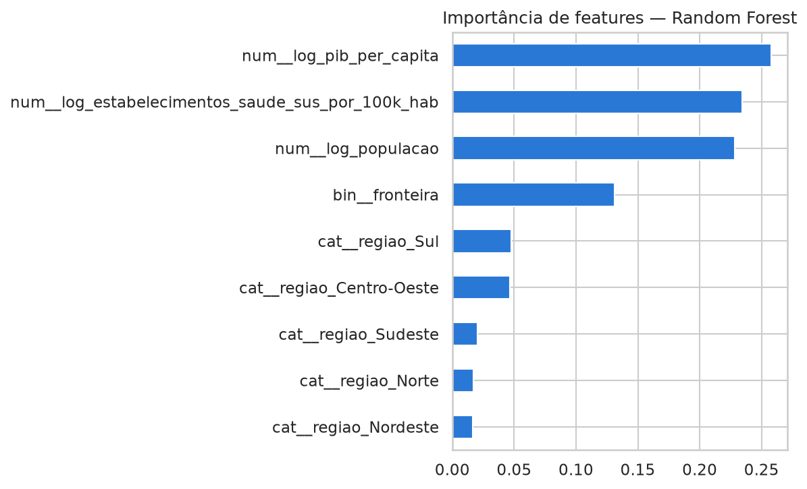
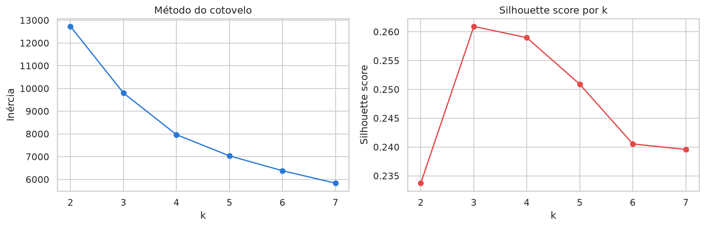
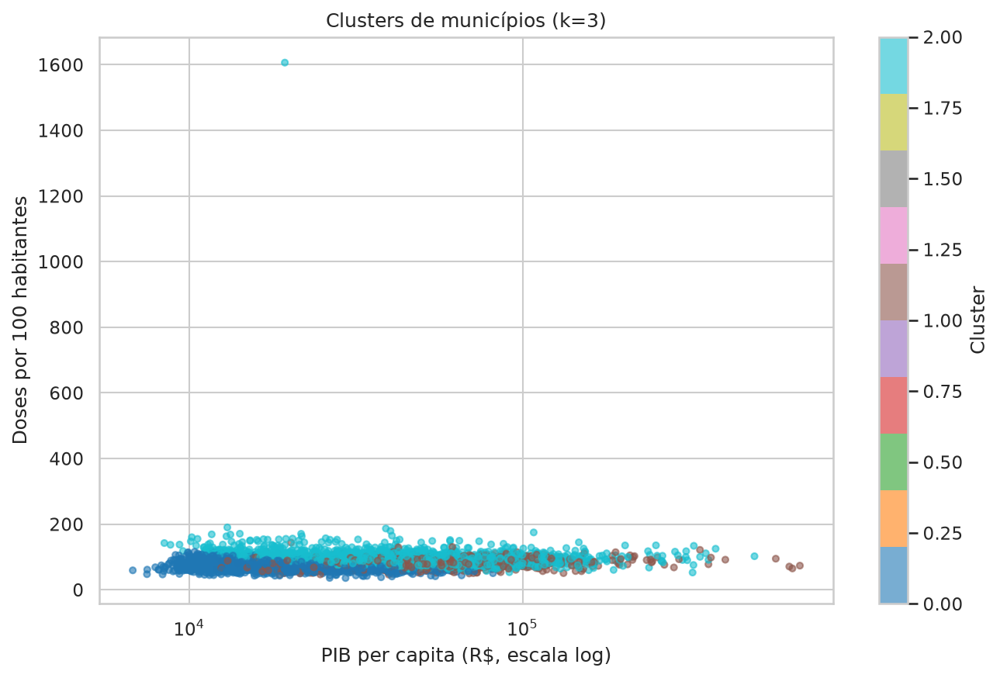
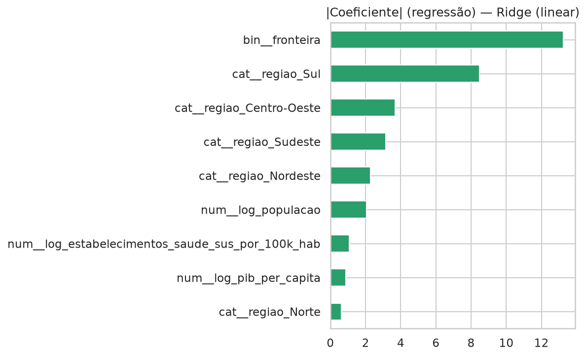
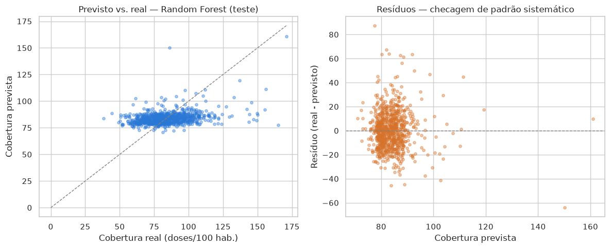

# Resultados da Modelagem (Etapa 3)

Este documento reúne, com texto explicativo, os gráficos gerados pelo
notebook [`notebooks/03_construcao_modelos.ipynb`](../notebooks/03_construcao_modelos.ipynb)
e salvos em `reports/` — mesmo espírito de
[`docs/analise_exploratoria.md`](analise_exploratoria.md) (Etapa 2): cada
gráfico vem acompanhado do porquê de ter sido gerado, do que mostra, e do
que isso significa para o objetivo do projeto. As decisões técnicas por
trás de cada escolha (alvo, split, algoritmos, métricas) estão
documentadas com a justificativa completa em
[`docs/decisoes_modelagem.md`](decisoes_modelagem.md); aqui o foco é
interpretar o que os números e gráficos realmente mostram.

## 1. Comparação de modelos de classificação

A pergunta desta seção é "qual dos algoritmos testados classifica melhor
o risco de baixa cobertura, e por quê?". Comparamos três modelos no
conjunto de **validação** (o teste ainda não foi usado neste ponto — ver
`docs/decisoes_modelagem.md`, seção 3, sobre por que o teste é reservado
para o final):

| Modelo | F1 validação | Accuracy | Precision | Recall | ROC-AUC |
|---|---|---|---|---|---|
| **Random Forest** (melhor) | **0,418** | 0,583 | 0,321 | 0,598 | 0,627 |
| Regressão Logística | 0,412 | 0,539 | 0,303 | 0,646 | 0,592 |
| XGBoost | 0,405 | 0,584 | 0,316 | 0,565 | 0,619 |

**Leitura:** Random Forest venceu por F1, com margem pequena sobre a
Regressão Logística (0,418 vs. 0,412) — o suficiente para justificar o
uso de um modelo mais robusto a não-linearidade, mas pequeno o bastante
para não descartar a Regressão Logística como alternativa mais simples e
interpretável, caso a explicabilidade seja prioridade para o gestor de
saúde pública. Regressão Logística e XGBoost, por sua vez, ficam
tecnicamente empatados por F1 (0,412 vs. 0,405), mas com um trade-off
bem diferente entre precisão e recall: a Regressão Logística prioriza
recall (0,646, o maior dos três) às custas de precisão (0,303, a menor);
XGBoost é mais conservador (recall 0,565, precisão 0,316) — para o caso
de negócio de priorizar campanhas, recall alto tem mais valor prático
(deixar de identificar um município de risco custa mais do que investigar
um que não precisava), o que reforça a Regressão Logística como
alternativa legítima ao Random Forest, não só um baseline a ser
descartado.

**Nota sobre o KNN:** uma versão anterior deste notebook também testou
KNN. Ele foi removido da comparação final — não por preferência
metodológica, mas porque a comparação com ele era estruturalmente
desigual (`KNeighborsClassifier` do scikit-learn não aceita o parâmetro
`class_weight`, então, ao contrário dos três modelos acima, nunca recebeu
o mesmo tratamento de desbalanceamento de classes) e, mesmo assim, teve o
pior F1 de validação (0,188) com o padrão clássico de um modelo
enviesado para a classe majoritária — maior acurácia (0,690) e, ao mesmo
tempo, menor recall (0,144) da comparação. Justificativa completa em
`docs/decisoes_modelagem.md`, seção 4.

## 2. Avaliação do modelo escolhido no teste

Depois de escolher o Random Forest com base só na validação, ele é
avaliado **uma única vez** no conjunto de teste (836 municípios) — a
estimativa final e não-viesada de desempenho.

**O que o gráfico mostra:** a matriz de confusão à esquerda tem 384
verdadeiros negativos, 243 falsos positivos, 99 falsos negativos e 110
verdadeiros positivos. A curva ROC à direita fica visivelmente próxima da
diagonal (que representaria um classificador aleatório), com AUC = 0,59.

**Leitura:** desses números, F1 = 0,391 e ROC-AUC = 0,591 no teste —
consistentes com a validação (0,418 e 0,627), sem sinal de que o modelo
"decorou" a validação. Em termos de negócio: o recall de 110/(110+99) ≈
0,53 significa que o modelo identifica pouco mais da metade dos
municípios realmente de baixa cobertura — bem acima de um sorteio
aleatório (que pegaria ~25%, a proporção da classe), mesmo sem ser um
preditor forte. A precisão de 110/(110+243) ≈ 0,31 mostra o outro lado:
de cada 10 municípios que o modelo aponta como risco, cerca de 3 de fato
são — os outros 7 seriam investigados à toa. Isso é o que caracteriza
esta ferramenta como um apoio à priorização, não um veredito automático.

## 3. Importância de features

Depois de saber que o modelo funciona (ainda que modestamente), a
pergunta natural é "o que ele está usando para decidir?".

**O que o gráfico mostra:** `log_pib_per_capita` lidera a importância
(~0,27), seguido de perto por `log_estabelecimentos_saude_sus_por_100k_hab`
(CNES, ~0,23) e `log_populacao` (~0,23), depois `bin_fronteira` (~0,13) e,
com contribuição bem menor, as dummies de região.

**Leitura:** o achado mais interessante aqui é o CNES. Ele tem correlação
de Pearson fraca com a cobertura quando medida isoladamente (0,089,
calculada na própria construção do dataset — ver
`docs/decisoes_modelagem.md`, seção 1), mas aparece em **2º lugar** na
importância do Random Forest, à frente até da população. Isso não é
contraditório: correlação de Pearson mede só relação linear univariada,
enquanto a importância de uma árvore captura interações não-lineares
entre features que a correlação simples não enxerga. Interpretação
registrada em `docs/decisoes_modelagem.md`, seção 8: o CNES carrega sinal
real, mesmo sem mover o F1/ROC-AUC agregado — o valor do enriquecimento
de features aparece mais como ferramenta de priorização/explicação do que
como ganho de métrica agregada.

## 4. Clusterização — quantos perfis de município existem?

Além de classificar risco, o projeto também segmenta municípios por
perfil (população, PIB per capita e cobertura) — um problema
não-supervisionado, sem alvo. A primeira decisão é quantos grupos (*k*)
usar.

**O que o gráfico mostra:** a inércia (esquerda) cai suavemente do k=2 ao
k=7, sem um "cotovelo" visualmente óbvio — por isso a decisão não se
apoiou só nessa curva. O silhouette score (direita) tem um pico claro em
k=3 (≈0,261), caindo depois disso.

**Leitura:** k=3 foi escolhido pelo critério mais objetivo dos dois — o
método do cotovelo aqui seria ambíguo por inspeção visual, mas o
silhouette score deixa claro que 3 grupos é onde cada município fica mais
bem encaixado no seu cluster em relação aos vizinhos (ver justificativa
completa em `docs/decisoes_modelagem.md`, seção 6).

**O que o gráfico mostra:** os três clusters plotados por PIB per capita
(escala log) vs. cobertura — visualmente, a separação entre eles não é
óbvia neste plano 2D (o KMeans usa três dimensões: população, PIB per
capita e cobertura, todas em log), mas os números por trás contam uma
história clara:

| Cluster | Municípios | Cobertura média | População mediana | PIB per capita médio | % fronteira |
|---|---|---|---|---|---|
| 0 | 2.278 | 75,57 | 11.551,5 | R$ 18.797,41 | 13% |
| 1 | 1.198 | 80,99 | 52.338,0 | R$ 57.686,47 | 36% |
| 2 | 2.094 | **95,61** (maior) | **5.709,0** (menor) | R$ 50.354,93 | 48% |

**Leitura:** o Cluster 0 — maior grupo, menor cobertura média (75,6),
população mediana pequena (11.551 hab.) e PIB per capita mais baixo dos
três (R$ 18.797) — é o candidato natural a prioridade em campanhas de
imunização. O Cluster 2, de maior cobertura média (95,6), é também o de
**menor população mediana** (5.709 hab.) entre os três, e o de maior
percentual de municípios de fronteira (48%). Isso é um sinal de alerta,
não uma boa notícia sem ressalvas: a seção 5 do notebook 02 já mostrou
que municípios pequenos têm a métrica de cobertura mais volátil (poucas
doses mudam bastante o percentual), e a seção 4 mostrou o efeito de
fronteira inflando cobertura por atendimento a não-residentes. A
cobertura mais alta deste cluster provavelmente é, em parte, esse duplo
efeito — não necessariamente melhor acesso real à vacinação. Tratar o
Cluster 2 como "referência de boa cobertura" sem essa ressalva seria uma
leitura ingênua dos dados.

## 5. Enquadramento complementar: regressão da cobertura contínua

A classificação (seções 1-2) responde uma pergunta binária — "este
município está entre os piores 25% do país?" — que descarta informação
por construção: dois municípios abaixo do corte, um levemente e outro
extremamente, recebem o mesmo rótulo. A regressão prevê a cobertura
contínua diretamente, para desempatar a ordem dentro do grupo de risco
(justificativa completa em `docs/decisoes_modelagem.md`, seção 7).

Comparação na validação (mesmo split da classificação):

| Modelo | RMSE validação | R² validação | Tempo de treino |
|---|---|---|---|
| **Ridge (linear)** (melhor) | **54,66** | 0,015 | 0,4s |
| XGBoost | 54,68 | 0,015 | 10,8s |
| Random Forest | 54,76 | 0,012 | 43,5s |

**Leitura:** os três modelos empatam tecnicamente — a diferença de RMSE
entre eles (0,1 numa escala de ~55) é ruído, não sinal. Isso não é uma
falha da regressão: é o próprio achado. Três algoritmos de naturezas
diferentes (um linear, dois em árvore) batendo no mesmo teto baixo de R²
confirma, com mais força ainda do que a classificação sozinha, que o
problema é a pobreza do conjunto de features disponível — não a escolha
de algoritmo (ver `docs/decisoes_modelagem.md`, seção 7).

No teste, o modelo vencedor (Ridge) chegou a RMSE = 15,81, MAE = 11,90 e
R² = 0,062.

**O que o gráfico mostra:** para um modelo linear como o Ridge, a
"importância" é o valor absoluto do coeficiente de cada feature.
`bin_fronteira` domina disparado (≈13), à frente de `cat_regiao_Sul`
(≈8,5) e das demais regiões; `log_pib_per_capita` aparece entre os
coeficientes mais baixos (≈0,9).

**Leitura:** o mesmo padrão da classificação se repete aqui — fronteira é
o sinal mais forte, e PIB per capita quase não pesa na decisão do modelo.
Isso reforça, com um segundo algoritmo independente, o achado da EDA
(seção 6 de `docs/analise_exploratoria.md`): o efeito geográfico de
fronteira é uma variável mais relevante para explicar a cobertura do que
renda per capita.

**O que o gráfico mostra:** à esquerda, cobertura prevista vs. real no
teste — os pontos previstos ficam concentrados numa faixa estreita
(~75-100), quase sem acompanhar a variação real do eixo x (que vai de
~40 a ~190). À direita, os resíduos (real − previsto) espalhados sem um
padrão sistemático óbvio em torno de zero, incluindo alguns pontos bem
acima de 60-100 de resíduo.

**Leitura:** o modelo está, na prática, prevendo perto da média para
quase todos os municípios — o que é exatamente o que um R² de 0,062
significa visualmente. Os resíduos não mostram um padrão sistemático
(por exemplo, um funil ou uma curva), o que é uma checagem de saúde
importante: o modelo erra de forma consistente em magnitude, não de um
jeito que sugira uma variável relevante ficou de fora de forma
estruturada — reforça, mais uma vez, que a limitação é volume/variedade
de features, não um bug ou uma feature crítica ausente.

## 6. Síntese

Os seis gráficos deste documento contam a mesma história por ângulos
diferentes: o pipeline funciona, os modelos são honestos sobre suas
limitações, e o sinal mais forte disponível nos dados — de longe — é o
efeito geográfico de fronteira, não renda (PIB per capita) nem, sozinha,
a infraestrutura de saúde (CNES). As decisões que vieram desses achados
(alvo binário por quartil, cinco/seis features, clusterização em 3
grupos, regressão como complemento) estão registradas com a justificativa
completa em [`docs/decisoes_modelagem.md`](decisoes_modelagem.md), assim
como as limitações conhecidas e os próximos passos priorizados pela
equipe.
